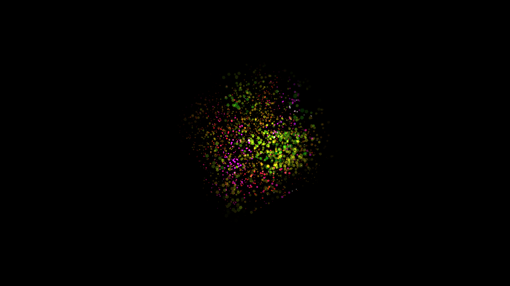

# abstract_plasma_fluid_dynamics_3d

## Metadata
- **Date**: 2026-06-20
- **Theme**: A swirling, volumetric plasma fluid simulation represented by colored points and spheres on a 3D gri
- **Technique**: Unknown
- **Logic Lab Reference**: 

## Concept
A swirling, volumetric plasma fluid simulation represented by colored points and spheres on a 3D grid.

## Technical Details
- **Renderer**: Unknown
- **Simulation**: Unknown
- **Visuals**: Unknown
- **Animation**: Contains animation details
