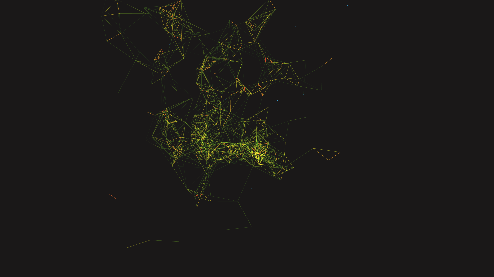

# abstract_quantum_entanglement_web_3d

## Details
- **Date**: 2026-06-06
- **Format**: Animation (10s @ 60fps)
- **Theme**: A 3D network of glowing nodes and edges where connections spontaneously form and break based on spatial proximity as the entire structure shifts organically.

## Technique
$N$ points drifting through 3D space driven by 3D `os_noise`. An $O(N^2)$ distance check connects nearby nodes with lines. Color and opacity of the lines are mapped to distance, creating a breathing, glowing neural/quantum web.

