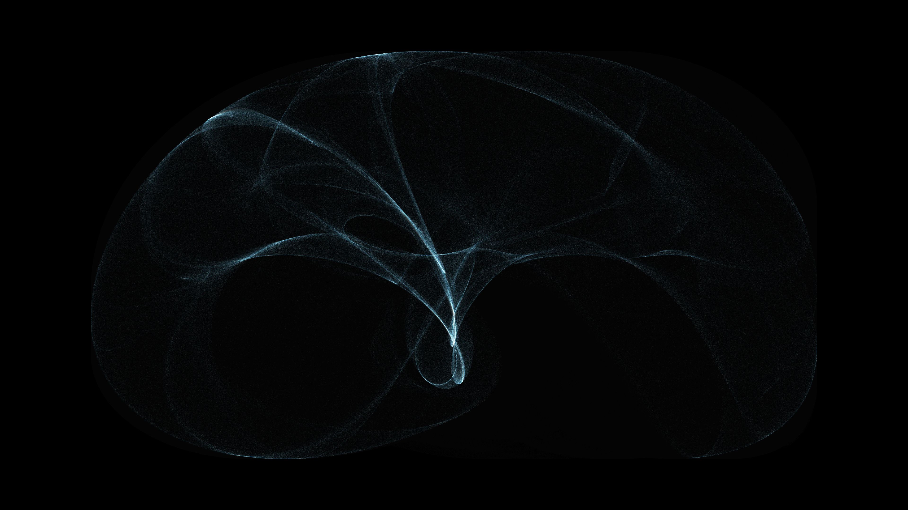

# abstract_strange_attractor_morph_2d

## Metadata
- **Date**: 2026-06-27
- **Theme**: A celestial simulation where millions of glowing particles trace out the complex, chaotic pathways o
- **Technique**: The sketch utilizes a high-performance 2D particle simulation, calculating the Peter de Jong strange attractor equations for 200,000 points per frame. By animating the variables $a, b, c,$ and $d$ using continuous sine and cosine functions, the attractor dynamically shifts its structure. The simulation is rendered with additive blending (`BLEND_MODE(ADD)`) and a subtle background fade, creating intense glowing motion trails and a luminous, gaseous effect as the particles accumulate in dense chaotic regions.
- **Logic Lab Reference**: 

## Concept
A celestial simulation where millions of glowing particles trace out the complex, chaotic pathways of a Peter de Jong strange attractor. As the mathematical parameters of the attractor slowly mutate over time, the glowing particles weave and fold, causing the dense nebula-like shape to breathe and continuously morph into new intricate forms.

## Technical Details
- **Renderer**: Unknown
- **Simulation**: Unknown
- **Visuals**: Unknown
- **Animation**: Contains animation details
