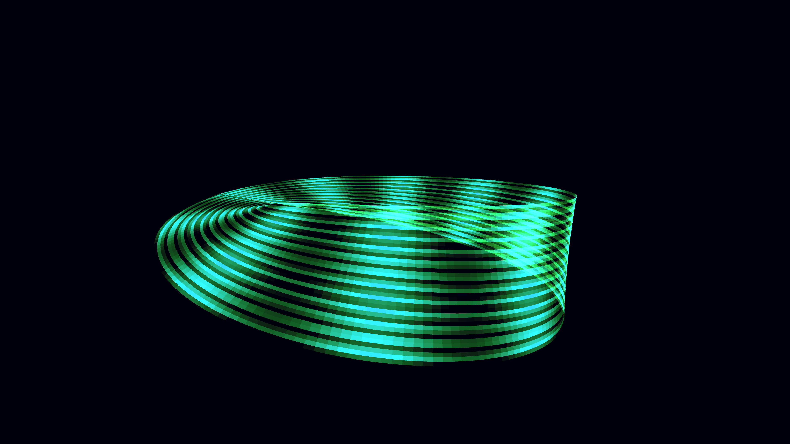

# abstract_topological_mobius_strip_3d

## Details
- **Date**: 2026-06-07
- **Theme**: An infinite, non-orientable topological surface (a Mobius strip) that constantly flows with glowing energy lines, symbolizing eternity and impossible geometry.
- **Technique**: Parametric 3D generation of a Mobius strip using a dense grid of QUADS. Additive blending and neon glowing materials. Energy flows trace the UV paths along the surface using sine waves and frame count.
- **Palette**: Obsidian violet background, deep violet dominant, electric blue and neon pink accents.

## Media

