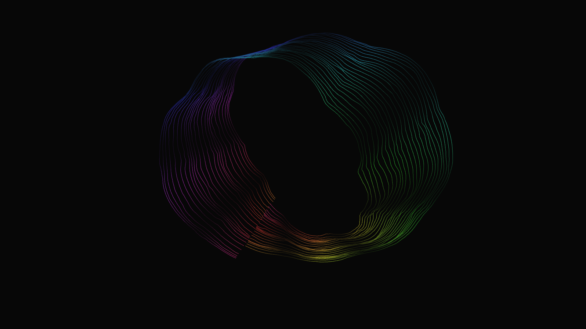

# abstract_topological_moebius_strip

## Metadata
- **Date**: 2026-05-24
- **Theme**: A kinetic 3D wireframe visualization of a non-orientable topological surface (the Möbius strip)
- **Technique**: Unknown
- **Logic Lab Reference**: 

## Concept
A kinetic 3D wireframe visualization of a non-orientable topological surface (the Möbius strip).

- **Date**: 2026-05-23
- **Theme**: Topology, non-orientable surfaces, Möbius strip, sacred geometry, infinite loops, energy streams.
- **Technique**: Evaluates the parametric mathematical equations for a Möbius strip over a dense $u,v$ coordinate grid. Rather than rendering a solid surface, the script draws only discrete longitude lines (`LINE_STRIP`) along the $V$ axis, creating the appearance of a hollow, glowing wireframe track or energy ribbon. The twist factor of the Möbius strip is animated over time using a sine wave, causing the non-orientable geometry to mathematically warp and "break" its topology as it spins. High-frequency 3D Perlin noise and additive blending give the lines a crackling, energetic plasma texture. 15s 60fps MP4.
- **Description**: A massive, glowing ribbon of neon light twists endlessly through a dark void. The ribbon is a perfect Möbius strip—a paradoxical geometric shape with only one side and one edge. As it rotates, the mathematical parameters of the strip smoothly mutate, causing the track to widen, narrow, and aggressively twist upon itself. The glowing cyan, magenta, and gold lines crackle with digital energy, creating an infinite, hypnotic loop that defies spatial logic.

## Technical Details
- **Renderer**: Unknown
- **Simulation**: Unknown
- **Visuals**: Unknown
- **Animation**: Contains animation details
