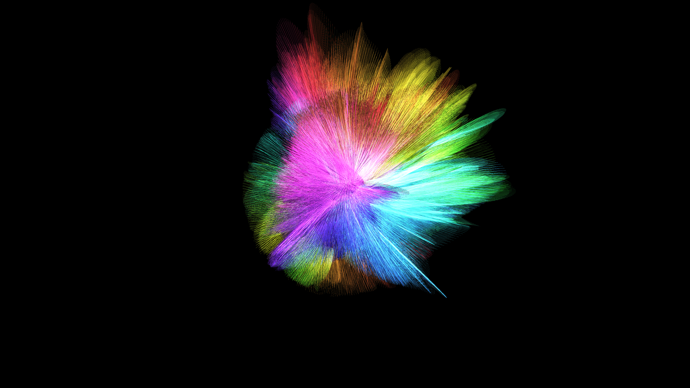

# abstract_woven_fiber_tapestry_3d

## Description

An animated 15s sequence of glowing fibers weaving a 3D tapestry in deep space.
The sketch uses procedural generation with `py5.line` to connect opposite points on a parametric cylinder, perturbed by `py5.os_noise`. Additive blending and subtle background dimming create ethereal woven light trails.

## Output

