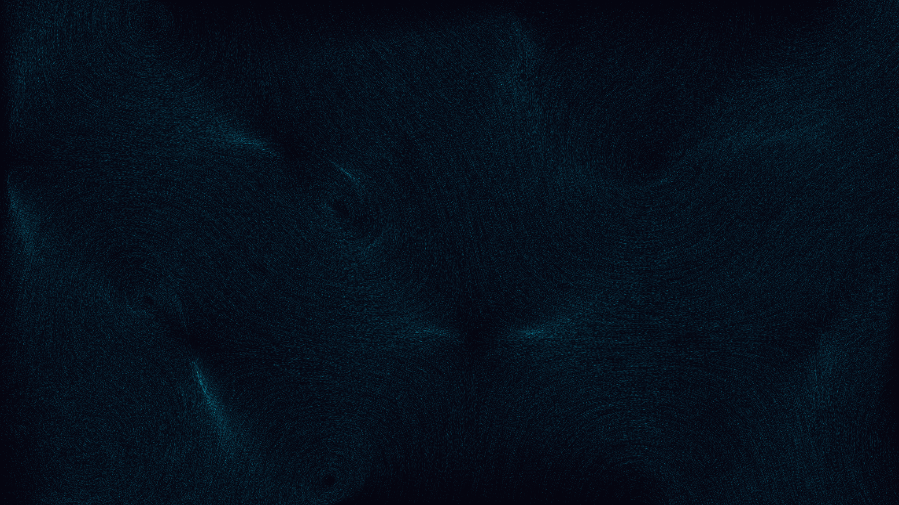

# abyssal_curl_whorls

Bioluminescent ethereal vines weaving through a dark aquatic abyss, guided by an invisible curl noise current.

## Details

- **Date**: 2026-05-30
- **Theme**: Bioluminescent ethereal vines weaving through a dark aquatic abyss, guided by an invisible curl noise current.
- **Technique**: Vectorized Curl Noise flowfield. Millions of particles trace the curl of a simplex noise field, creating beautiful whorls and vortices that never collide.
- **Palette**: Deep abyssal navy, bioluminescent teal, soft magenta, electric lime.

## Previews



## Usage

```bash
uv run python main.py
```
