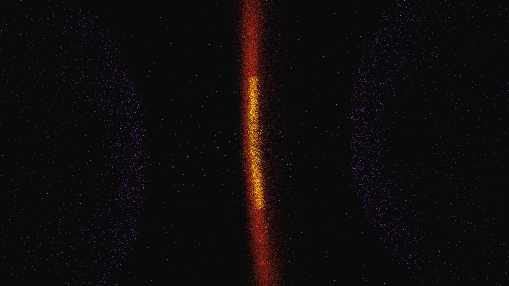

# accretion_disk_instability

## Metadata
- **Date**: 2026-05-09
- **Theme**: Black hole accretion, disk turbulence, Magneto-Rotational Instability (MRI), polar jets, beautiful night sky.
- **Technique**: 3D simulation of 180,000 particles following Keplerian rotation dynamics ($v \propto 1/\sqrt{r}$). Implements turbulent noise-driven advection within the disk and high-velocity polar jets with plasma-like jitter. Multi-pass additive point rendering with an "Incandescent Orange / Crimson Red / Ultraviolet Indigo" HSB palette and a subtle high-density starfield. 60fps high-bitrate MP4.
- **Logic Lab Reference**: None

## Concept
A majestic vision of a star's final descent; silken filaments of incandescent orange and crimson light spiral into the dark heart of a black hole, creating a complex, shimmering disk that pulses with thermal instability. Violent jets of ultraviolet indigo plasma erupt from the poles, tracing the invisible magnetic conduits that channel energy away from the gravitational abyss against the star-dusted obsidian night.

## Technical Details
- **Renderer**: P3D
- **Simulation**: particle.
- **Visuals**: additive blending, HSB spectral mapping.
- **Animation**: 25 seconds at 60fps
