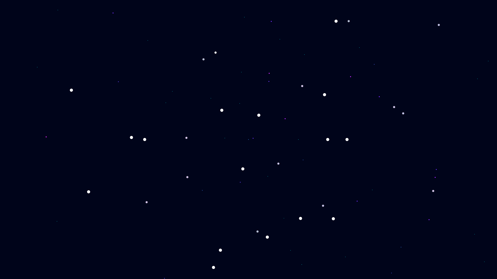

# acoustic_cavitation_luminescence

## Metadata
- **Date**: 2026-05-10
- **Theme**: Sonoluminescence, cavitation bubbles, acoustic standing waves, star in a jar.
- **Technique**: 3D particle and sphere simulation. 30,000 "micro-bubbles" trapped in a volumetric acoustic standing wave (represented by a 3D sine field). As they reach the high-pressure antinodes, they collapse rapidly and emit intense flashes of broad-spectrum light (UV to visible). Additive blending with short-lived blinding white sparks.
- **Logic Lab Reference**: None

## Concept
A deep, liquid-like void where thousands of tiny cyan and violet bubbles drift, occasionally shrinking violently to erupt into blindingly bright, rhythmic flashes of white starlight.

## Technical Details
- **Renderer**: P3D
- **Simulation**: particle, 3D particle.
- **Visuals**: additive blending, dark-field contrast.
- **Animation**: 15 seconds at 60fps
