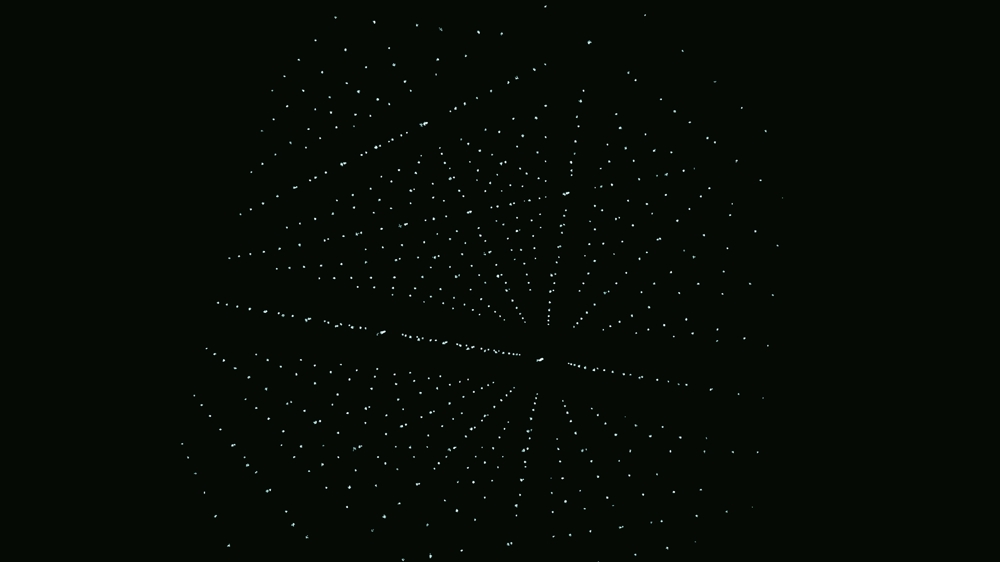

# acoustic_levitation_drift

## Metadata
- **Date**: 2026-05-13
- **Theme**: Acoustic levitation, Gorkov potential, standing wave resonance, particle trapping.
- **Technique**: 3D Gorkov potential simulation. Particles are trapped in the nodes of a 3D standing wave field. The phase of the standing wave is slowly modulated, causing the trapped "beads" of light to drift and reorganize. 15s 4K/60fps MP4.
- **Logic Lab Reference**: None

## Concept
A dark void where thousands of silver and cyan specks are suspended in an invisible, vibrating grid. The grid slowly shifts and warps, carrying the specks in a rhythmic, coordinated dance that reveals the hidden geometry of sound.

## Technical Details
- **Renderer**: P2D
- **Simulation**: particle.
- **Visuals**: layered py5 drawing.
- **Animation**: Still image
