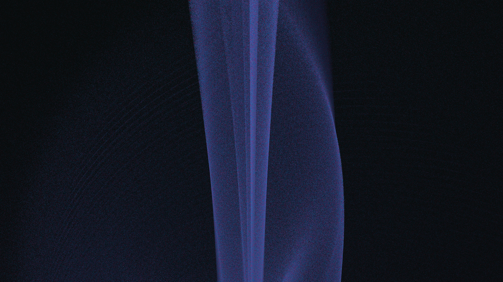

# aizawa_chaotic_sphere

A chaotic storm of 1.5 million particles swept into the beautiful sphere-and-tube geometry of the Aizawa Strange Attractor.

## Details

- **Date**: 2026-05-31
- **Theme**: A chaotic storm of 1.5 million particles swept into the beautiful sphere-and-tube geometry of the Aizawa Strange Attractor.
- **Technique**: Millions of particles simulating the Aizawa non-linear differential equations using Euler integration. The 3D coordinates are dynamically rotated and projected into 2D perspective using NumPy matrix math, and then written directly into pixel memory with depth-based dimming.
- **Palette**: Dark space void with neon purple, pink, cyan, and deep blue particles forming a glowing, semi-transparent sphere.

## Previews



## Usage

```bash
uv run python main.py
```
