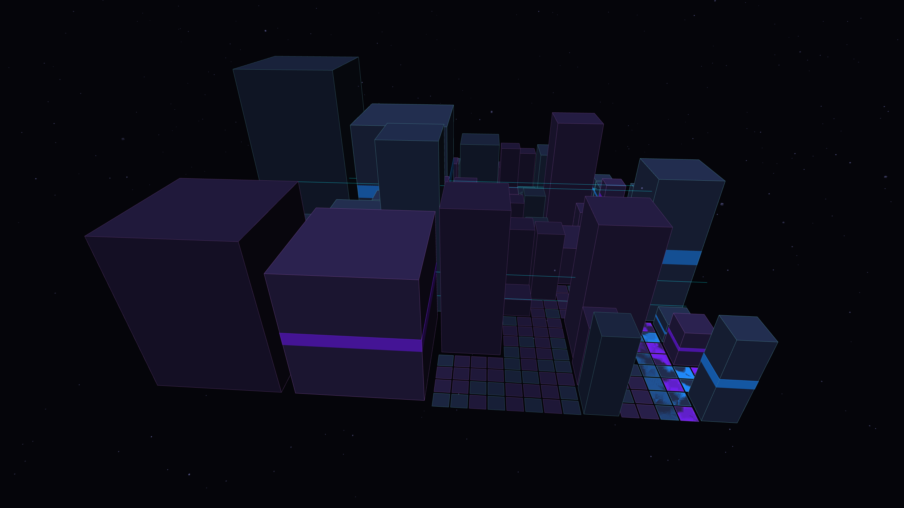

# algorithmic_architecture

## Metadata
- **Date**: 2026-05-05
- **Theme**: Recursive urbanism, digital metabolism, synthetic metropolis, beautiful night sky.
- **Technique**: 3D recursive quadtree construction (P3D), luminous data highways, dynamic camera rotation, high-density starfield rendering.
- **Logic Lab Reference**: None

## Concept
A vast, shimmering digital metropolis generated by 3D recursive quadtree subdivision that appears to pulse with life; glowing electric cyan and royal amethyst data highways flow across dense architectural forms against a star-dusted midnight sky.

## Technical Details
- **Renderer**: P3D
- **Simulation**: recursive.
- **Visuals**: bloom-like highlights, dark-field contrast.
- **Animation**: 10 seconds at 60fps
