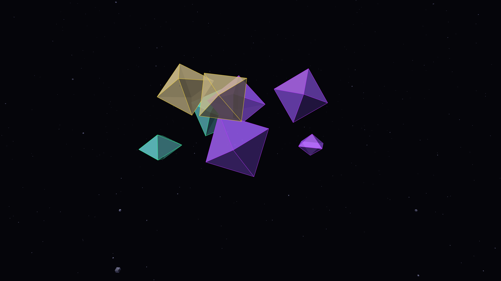

# algorithmic_crystals

## Metadata
- **Date**: 2026-05-05
- **Theme**: Digital mineralization, recursive lattices, geometric resonance, beautiful night sky
- **Technique**: 3D recursive lattice growth (P3D), iridescent surface mapping, luminous internal glow, high-density starfield rendering

## Concept
An intricate visualization of synthetic mineralization where glowing digital geodes in molten gold, cyber lime, and royal amethyst pulse and divide in a deep void; the shimmering celestial tapestry of geometric resonance pulses with a rhythmic harmony against a star-dusted midnight sky.

## Technical Details
- **Renderer**: P3D
- **Simulation**: 3D recursive lattice growth (P3D)
- **Visuals**: iridescent surface mapping, luminous internal glow, high-density starfield rendering
- **Animation**: 10s @ 60fps (typical)
