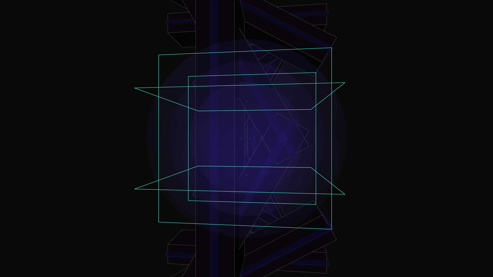

# algorithmic_geode

A 3D architectural sketch featuring a recursive quadtree city core encased in jagged obsidian-like shards, exploring themes of digital mineralization and urban recursion.

- **Date**: 2026-05-06
- **Theme**: Digital mineralization, urban recursion, inner light, modern city feel, beautiful night sky
- **Technique**:
    - **Architecture**: A monolithic geode-like structure composed of 12 graphite shards with sharp edge highlights.
    - **Recursion**: A recursive quadtree algorithm generates an infinitely dense city grid on the interior faces of the core.
    - **Visuals**: HSB-based neon highlights (Cyan/Magenta/Indigo) with additive bloom layers and volumetric light "leaks" from the seams.
    - **Animation**: 10 seconds @ 60fps, featuring a slow zoom and rotation that reveals the scale of the metropolitan interior.

