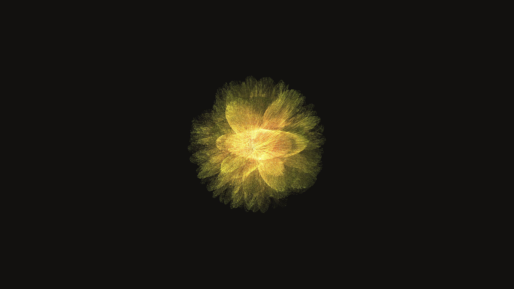

# algorithmic_resonance_chambers

## Metadata
- **Date**: 2026-05-29
- **Theme**: - **Date**: 2026-05-29 - **Theme**: Abstract architectural spaces constructed of pure frequency wher
- **Technique**: Unknown
- **Logic Lab Reference**: 

## Concept
- **Date**: 2026-05-29
- **Theme**: Abstract architectural spaces constructed of pure frequency where standing waves form glowing, translucent geometric structures that hum and phase out of existence.
- **Technique**: A 3D simulation of multiple intersecting spherical harmonics acting as constructive interference fields. Uses an isometric camera view with additive-blended py5.points to trace the complex nodal shapes as the frequencies slide over time.
- **Description**: An animated glowing architectural geometry governed by spherical harmonics.

## Technical Details
- **Renderer**: Unknown
- **Simulation**: Unknown
- **Visuals**: Unknown
- **Animation**: Unknown
