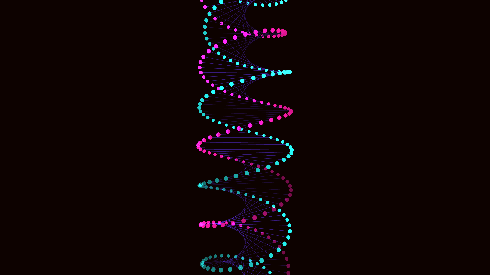

# alien_geometric_dna_helix_3d

## Details
- **Date**: 2026-06-07
- **Theme**: A microscopic view of an alien geometric DNA strand spinning and glowing in the deep ocean.
- **Technique**: Two intertwined helical strands made of glowing orbs, with connected lines representing base pairs. The helix rotates and softly undulates with 1D noise.
- **Palette**: Obsidian background, bioluminescent teal, radiant magenta.

## Media

