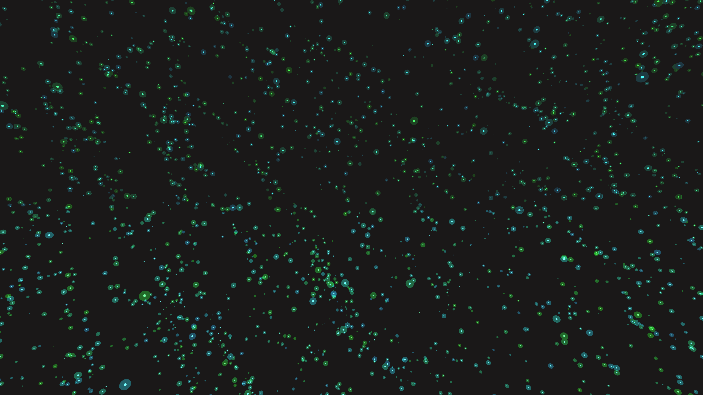

# ambient_bioluminescent_fractal_spores_3d

## Metadata
- **Date**: 2026-06-20
- **Theme**: Thousands of tiny bioluminescent spores drifting through a 3D cavern, governed by a fractal flow fie
- **Technique**: A 3D particle system where velocities are derived from a multi-octave 3D Perlin noise vector field. Overlapping spheres with additive blending mimic glowing spores. The camera slowly tracks forward to give a sense of depth and scale.
- **Logic Lab Reference**: 

## Concept
Thousands of tiny bioluminescent spores drifting through a 3D cavern, governed by a fractal flow field.

## Technical Details
- **Renderer**: Unknown
- **Simulation**: Unknown
- **Visuals**: Unknown
- **Animation**: Contains animation details
