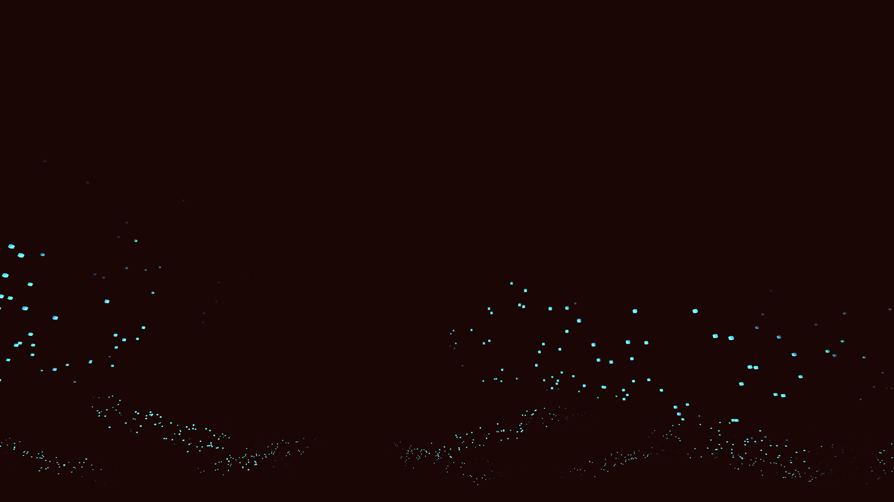

# ambient_bioluminescent_plankton_waves_3d

## Metadata
- **Date**: 2026-06-21
- **Theme**: An animated 15s sequence of a generative 3D simulation of glowing waves
- **Technique**: Unknown
- **Logic Lab Reference**: 

## Concept
An animated 15s sequence of a generative 3D simulation of glowing waves. Bioluminescent plankton crash in the dark, lighting up as they collide with invisible shores and obstacles, rendered as a 3D fluid-like particle simulation.

- **Theme**: Waves of bioluminescent plankton crashing in the dark, lighting up as they collide with invisible shores and obstacles.
- **Technique**: A dense field of 3D particles that move according to sine waves and 3D Perlin noise. When particles move quickly or reach the crest of a wave, their brightness and size temporarily spike, simulating a bioluminescent flash. Additive blending in a dark background.

## Technical Details
- **Renderer**: Unknown
- **Simulation**: Unknown
- **Visuals**: Unknown
- **Animation**: Unknown
