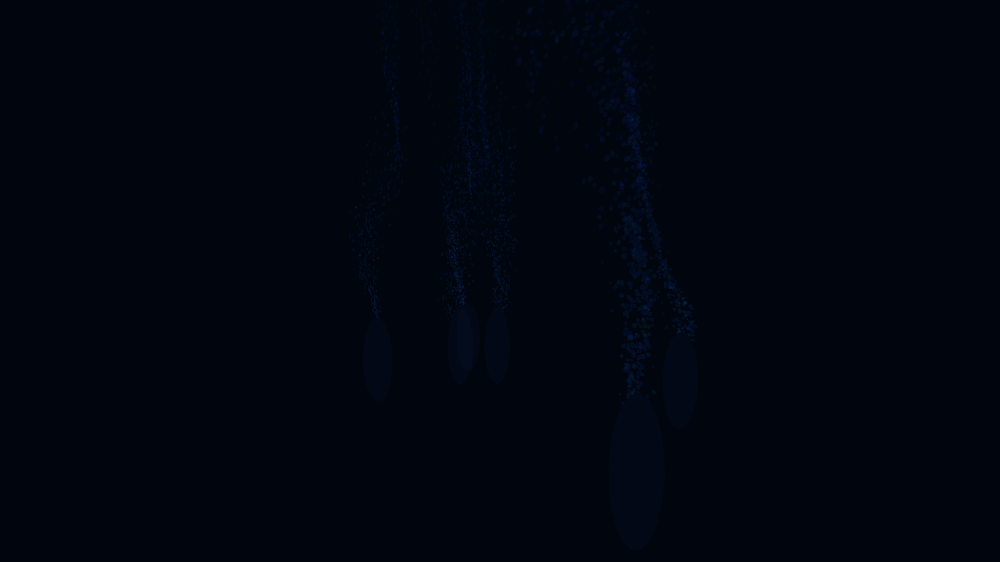

# ambient_deep_sea_hydrothermal_vents_3d

## Metadata
- **Date**: 2026-06-21
- **Theme**: An animated 15s sequence of a generative 3D simulation of deep-sea hydrothermal vents
- **Technique**: Unknown
- **Logic Lab Reference**: 

## Concept
An animated 15s sequence of a generative 3D simulation of deep-sea hydrothermal vents. Glowing particle plumes rise from dark volcanic structures into the cold, deep ocean, dissipating as they drift upwards.

- **Theme**: A dark deep-sea environment where glowing hydrothermal vents spew neon energy particles into the cold water, creating organic blooming smoke trails.
- **Technique**: 3D particle system emitting from base cylinders. Particles have upward velocity and slowly disperse via 3D Perlin noise to simulate underwater turbulence. Rendered with additive blending, fading to darkness as they cool off.

## Technical Details
- **Renderer**: Unknown
- **Simulation**: Unknown
- **Visuals**: Unknown
- **Animation**: Unknown
