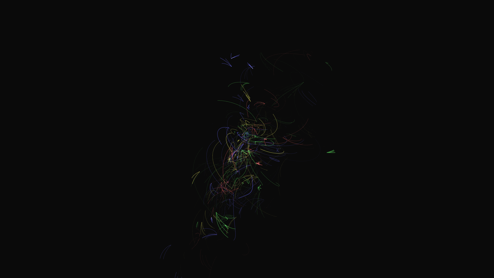

# ambient_subatomic_particle_collisions_3d

An animated sequence of abstract subatomic particle collisions.

- **Theme**: A visualization of a particle accelerator. High-energy particles collide in the center of the screen, creating showers of smaller glowing subatomic particles that spiral outwards due to abstract magnetic fields.
- **Technique**: A 3D particle system with parent-child decay. Particles update velocity based on cross products with a Z-axis magnetic field vector, causing spiraling, along with 3D noise for turbulence. Rendered with additive blending.

