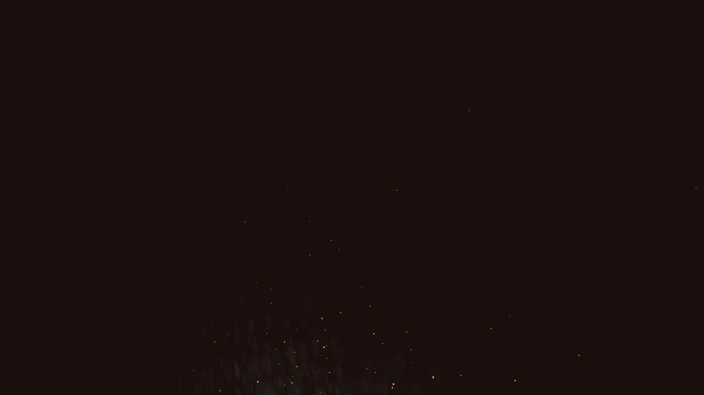

# ambient_volumetric_smoke_columns_3d

An animated 15s sequence of thick, dense columns of smoke slowly rising and interacting with each other in 3D space, lit from within by glowing embers.

- **Theme**: Thick, dense columns of smoke slowly rising and interacting with each other in 3D space, lit from within by glowing embers.
- **Technique**: A massive particle system where points are drawn as semi-transparent textures (using overlapping additive circles). They drift upwards, pushed laterally by 3D Perlin noise wind. Glowing "ember" particles occasionally spiral up through the smoke columns.

