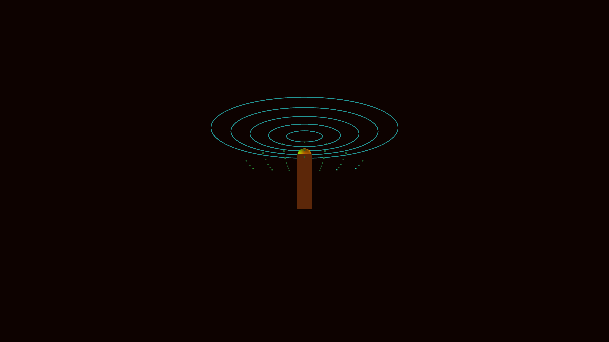

# ancient_alien_sacred_geometry_temple_3d

## Details
- **Date**: 2026-06-07
- **Theme**: A sprawling, ancient alien architectural complex dissolving into glowing sacred geometry patterns.
- **Technique**: Procedural structural grid with heightmaps modified by 3D noise. The structures dissolve into floating particles, overlaid by vector sacred geometry lines.
- **Palette**: Deep obsidian background, shimmering gold, ancient bronze, and glowing ethereal cyan.

## Media

