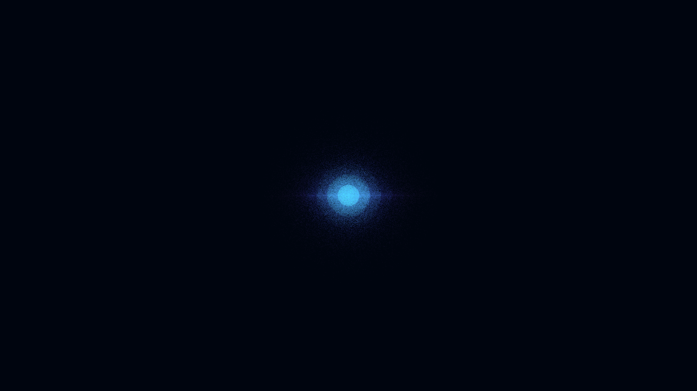

# anderson_localization_mesh

## Metadata
- **Date**: 2026-05-12
- **Theme**: Quantum physics, Anderson localization, disordered systems, metal-insulator transition.
- **Technique**: 3D grid simulation (150,000 particles). Grid nodes are randomly perturbed. A "localization" function (exponential falloff) determines particle density. Manual 3D-to-2D projection. 15s 4K/60fps MP4 (1080p source).
- **Logic Lab Reference**: None

## Concept
A vast, distorted 3D grid of silver threads floats in the dark, housing a blindingly bright, spherical concentration of electric blue and amethyst particles that represent a localized quantum wavefunction.

## Technical Details
- **Renderer**: P3D
- **Simulation**: particle.
- **Visuals**: HSB spectral mapping, bloom-like highlights, prismatic color, dark-field contrast.
- **Animation**: 15 seconds at 60fps
