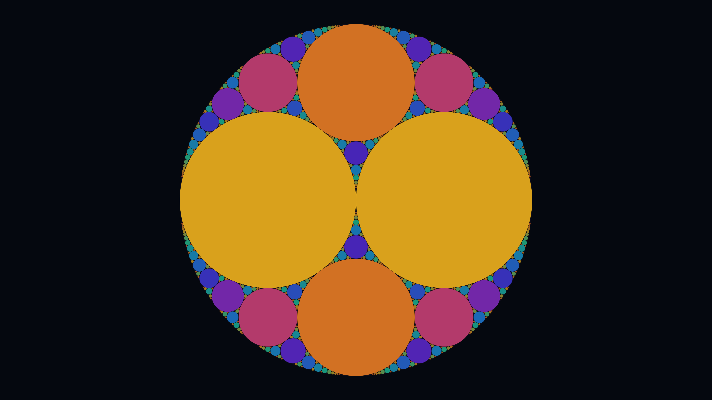

# apollonian_gasket

## Metadata
- **Date**: 2026-04-26
- **Theme**: mathematics, fractals, circle packing, recursive geometry.
- **Technique**: Descartes' Circle Theorem (inverse no-sqrt BFS formula), 6-stop curvature-octave palette, iterative gap filling.
- **Logic Lab Reference**: None

## Concept
Apollonian gasket from (-1,2,2,3) seed; each gap between three tangent circles is filled with a unique inscribed circle; 6-stop warm-to-cool palette cycles by curvature octave (log₂k), encoding scale as color while the fractal limit set emerges at the boundary.

## Technical Details
- **Renderer**: P2D
- **Simulation**: Descartes' Circle Theorem (inverse no-sqrt BFS formula), 6-stop curvature-octave palette, iterative gap filling.
- **Visuals**: bloom-like highlights, dark-field contrast.
- **Animation**: Still image
