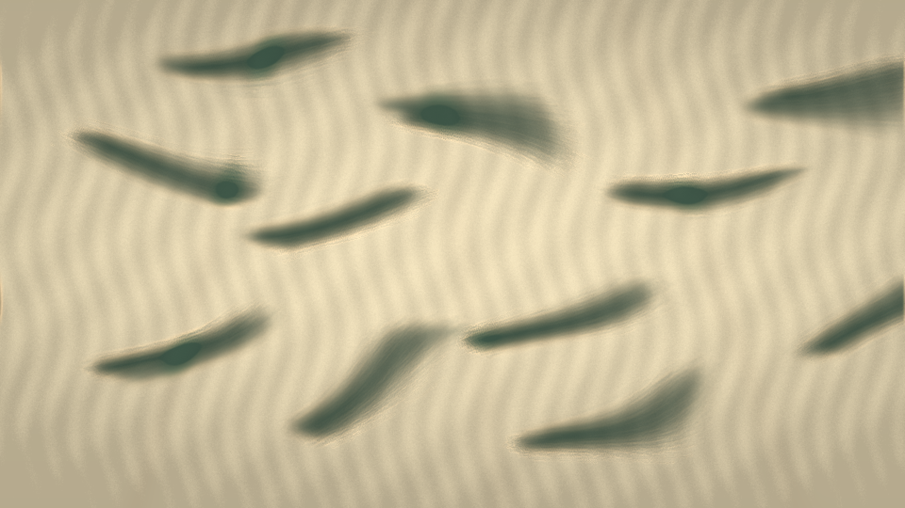

# archival_vein_memory

## Metadata
- **Date**: 2026-05-10
- **Theme**: archival paper remembering water damage, oxidized ink veins, quiet material decay.
- **Technique**: 2D anisotropic particle advection through a paper-fiber vector field. 65,000 particles deposit into low-resolution ink and oxide density buffers, which diffuse with restrained decay and are upscaled into the py5 pixel buffer. Fold-line crease masks bias the flow and tint oxidized regions with muted verdigris and copper edge highlights. 10s 4K/60fps MP4.
- **Logic Lab Reference**: None

## Concept
A warm parchment field where green-black stains slowly crawl along invisible fibers and old fold lines, forming soft archival veins with faint copper-rimmed edges and a quiet sense of paper remembering moisture.

## Technical Details
- **Renderer**: P2D
- **Simulation**: particle.
- **Visuals**: pixel-buffer rendering, bloom-like highlights, dark-field contrast.
- **Animation**: 10 seconds at 60fps
