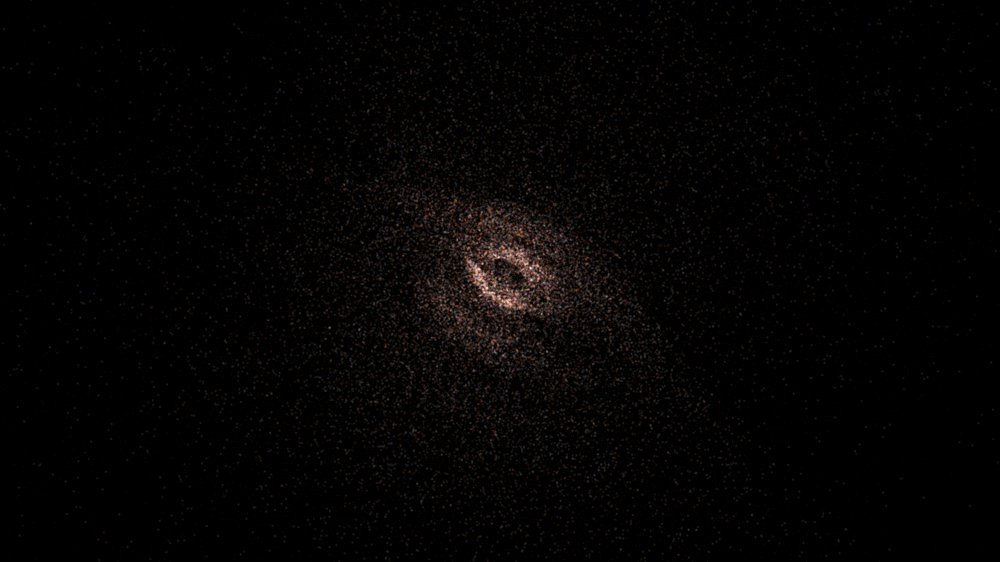
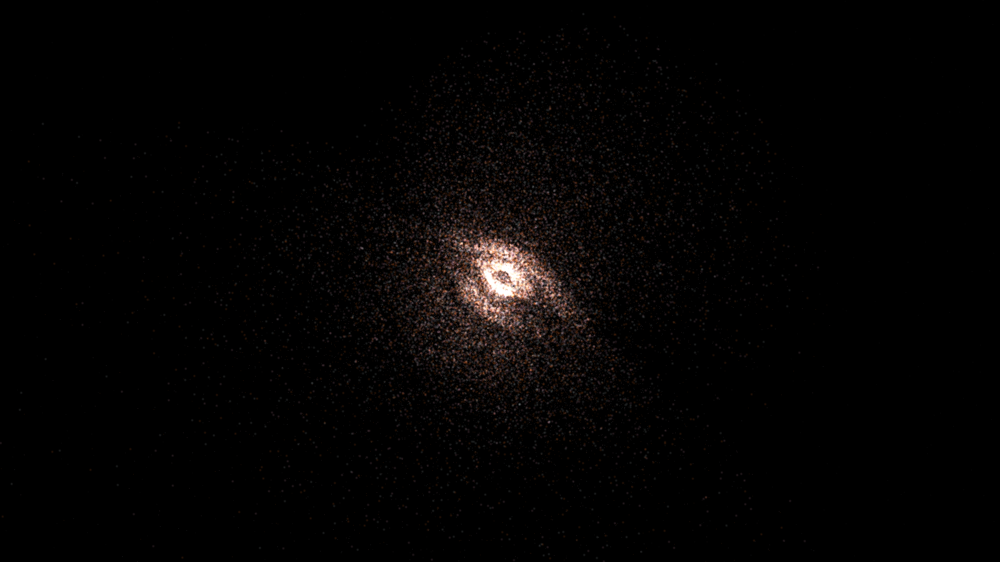

# asymptotic_giant_branch_pulsation

### Previews
- **Original 1080p:**
  
- **Upgraded 4K:**
  

## Metadata
- **Date**: 2026-05-11
- **Theme**: Stellar evolution, AGB stars, thermal pulses, planetary nebula precursor, stardust.
- **Technique**: 3D shell ejection simulation. A central core undergoes periodic pulses every 180 frames, triggering the expansion of nested, concentric shells of 15,000 tracers each (up to 150,000 total). 20s 4K/60fps MP4.
- **Logic Lab Reference**: None

## Concept
Concentric, shimmering shells of stardust expand slowly from a pulsing stellar core, creating a delicate, layered cocoon of rose and orange light.

## Technical Details
- **Renderer**: P2D
- **Simulation**: 3D shell ejection simulation.
- **Visuals**: HSB spectral mapping, bloom-like highlights, prismatic color, dark-field contrast.
- **Animation**: 20 seconds at 60fps
