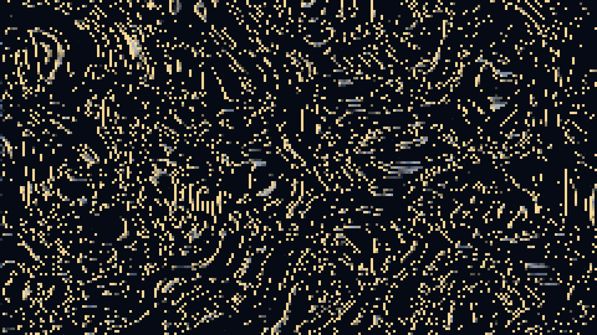

# atmospheric_veil

## Metadata
- **Date**: 2026-05-04
- **Theme**: Atmospheric light, noctilucent clouds, twilight, ethereal presence
- **Technique**: Second-order domain warping, fBm noise layers, height-dependent spectral coloring, derivative-based solar edge highlighting

## Concept
A luminous, shimmering veil of noctilucent clouds ripples across a deep indigo sky; pearlescent silver and electric blue textures catch a faint solar amber glow at their edges against a distant star field.

## Technical Details
- **Renderer**: P2D
- **Simulation**: Second-order domain warping
- **Visuals**: fBm noise layers, height-dependent spectral coloring, derivative-based solar edge highlighting
- **Animation**: 10s @ 60fps (typical)
