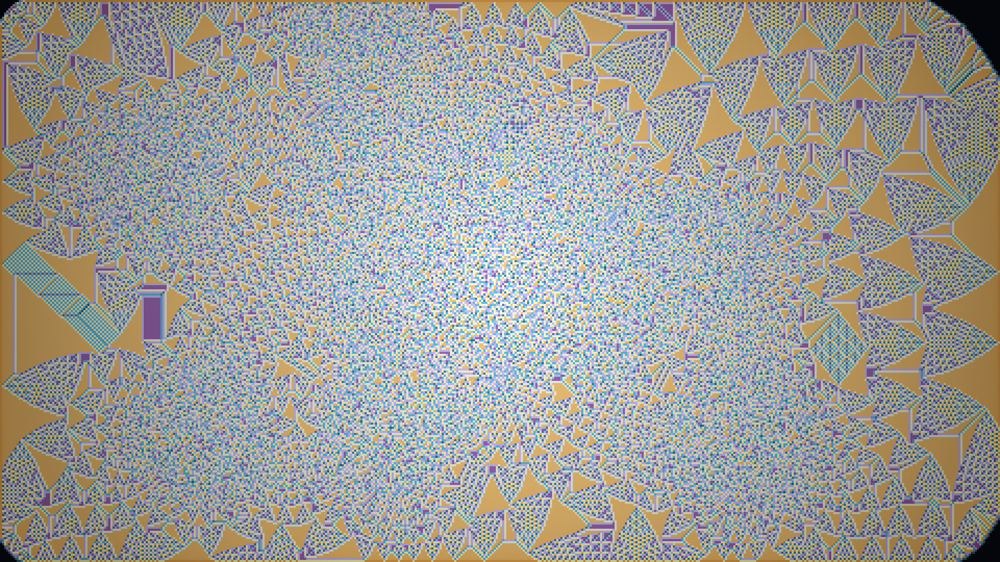

# avalanche_ledger

## Metadata
- **Date**: 2026-05-03
- **Theme**: arithmetic avalanche, computational sediment, collapse record
- **Technique**: Abelian sandpile relaxation, residue-state coloring, logarithmic topple heat layer, nearest-neighbor crisp upscaling

## Concept
A full-canvas computational avalanche leaves a sharp ledger of teal, mauve, ochre, and pale residues; dense central collapse patterns expand outward into blocky fractal boundaries and audit-like hatching.

## Technical Details
- **Renderer**: P2D
- **Simulation**: Abelian sandpile relaxation
- **Visuals**: residue-state coloring, logarithmic topple heat layer, nearest-neighbor crisp upscaling
