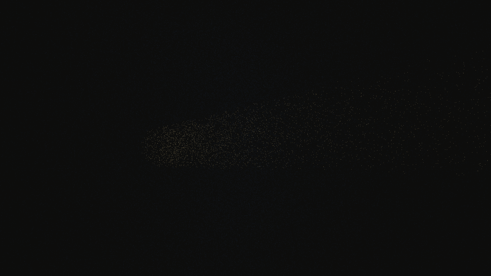

# axion_field_flux

## Metadata
- **Date**: 2026-05-07
- **Theme**: Dark matter, axion fields, Primakoff effect, scalar field oscillation, beautiful night sky.
- **Technique**: 3D high-density particle simulation (240,000 particles) using vectorized NumPy. Particles are sampled from a multi-harmonic 3D scalar field $\phi(x, t)$. Implements "Primakoff conversion" where particle visibility (alpha) is modulated by local field phase and distance from a central magnetic flux string. Features multi-pass additive rendering with a Gold/Indigo/Cyan palette and a high-density starfield (12,000 stars). 60fps high-bitrate MP4.
- **Logic Lab Reference**: None

## Concept
A majestic, shimmering vision of the hidden cosmos; a pulsing cloud of electric indigo and cyan light self-organizes into ghostly filaments around a blinding white-gold flux string, representing the conversion of dark matter axions into photons against the star-dusted obsidian void.

## Technical Details
- **Renderer**: P3D
- **Simulation**: Vectorized NumPy, NumPy, particle.
- **Visuals**: additive blending, HSB spectral mapping, bloom-like highlights, prismatic color, dark-field contrast.
- **Animation**: 15 seconds at 60fps
