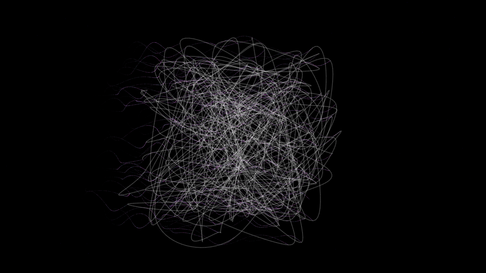

# axion_string_conversion

## Metadata
- **Date**: 2026-05-10
- **Theme**: Cosmic strings, axion-photon conversion, Primakoff effect, high-energy physics, beautiful night sky.
- **Technique**: 3D polyline simulation of vibrating cosmic strings; emission of 160,000 spectral particles advected by magnetic drift. Features smooth curve rendering and multi-pass additive point rendering.
- **Logic Lab Reference**: None

## Concept
A high-energy visualization of cosmic string dynamics; razor-sharp luminous threads pulse and snap in the obsidian void, emitting spectral clouds of cyan, violet, and magenta photons.

## Technical Details
- **Renderer**: P2D
- **Simulation**: particle.
- **Visuals**: additive blending, HSB spectral mapping, prismatic color.
- **Animation**: 15 seconds at 60fps
