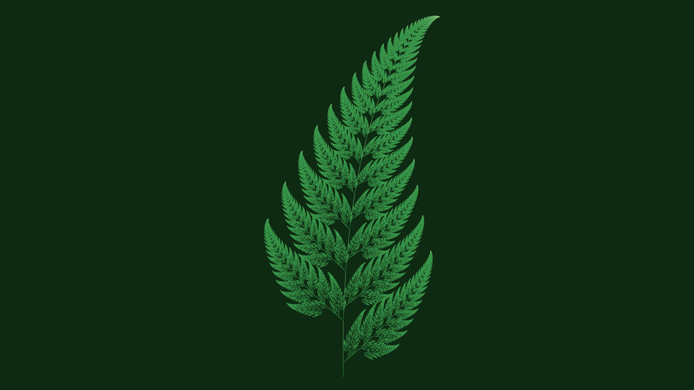

# barnsley_fern

## Metadata
- **Date**: 2026-04-26
- **Theme**: nature, botany, fractal, self-similarity, IFS.
- **Technique**: Barnsley IFS (4 affine transforms), 800k stochastic iterations, 2D density accumulation, log-scale 3-stop color gradient.
- **Logic Lab Reference**: None

## Concept
800k stochastic IFS iterations accumulate into a density field that reveals the Barnsley fern — stem, main self-similar frond, and paired lateral leaflets; log-scale mapping with a dark-forest-to-pale-tip gradient produces a photorealistic fractal fern frond.

## Technical Details
- **Renderer**: P2D
- **Simulation**: Barnsley IFS (4 affine transforms), 800k stochastic iterations, 2D density accumulation, log-scale 3-stop color gradient.
- **Visuals**: layered py5 drawing.
- **Animation**: Still image
