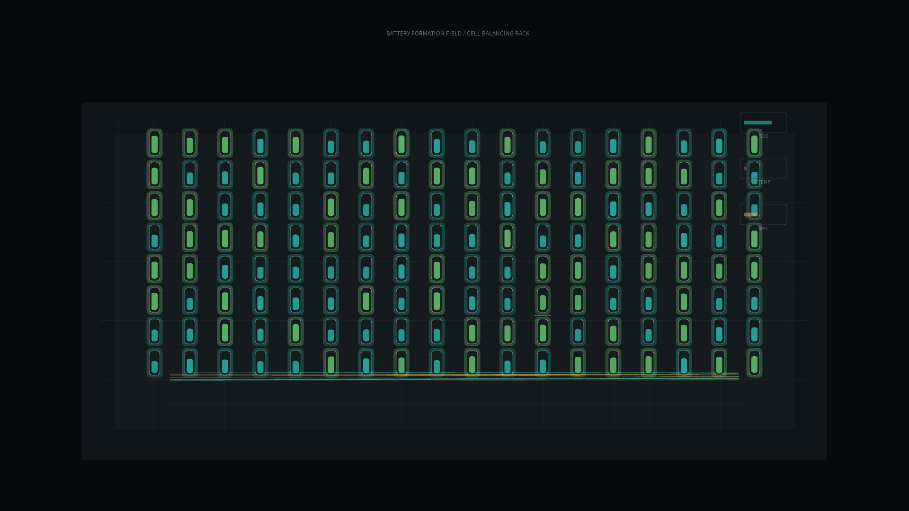

# battery_formation_field

## Metadata
- **Date**: 2026-05-19
- **Theme**: A battery-cell formation rack balancing hundreds of quiet charge states before the cells become useful.
- **Technique**: Procedural cell-array simulation with charge-state waves, balancing shunts, thermal drift, diagnostic traces, and rack-level meters.
- **Logic Lab Reference**: None

## Concept
`battery_formation_field` treats battery formation as a nocturnal calibration ritual. Rows of cells glow according to state of charge, red halos mark thermal drift, amber shunts bleed excess energy, and low diagnostic traces reveal the slow choreography of balancing.

## Technical Details
- **Renderer**: P2D
- **Simulation**: Grid of cells with stochastic charge phases, balancing thresholds, heat accumulation, and scrolling pack traces
- **Visuals**: Graphite formation rack, cyan/green charge glow, amber shunts, red thermal halos, silver diagnostic UI
- **Animation**: 10 seconds at 60fps, generating `output.mp4` and `battery_formation_field_p1.png`
