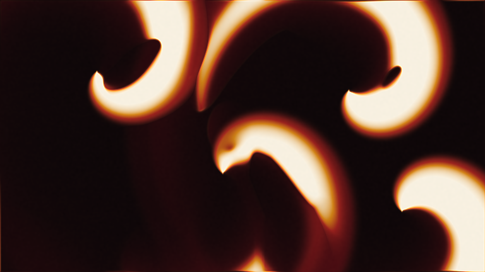

# belousov_zhabotinsky_spirals

## Metadata
- **Date**: 2026-05-13
- **Theme**: Oscillating chemical reactions forming self-sustaining spiral waves in a dark laboratory medium.
- **Technique**: Vectorized Barkley-model Belousov-Zhabotinsky excitable medium simulation on a 768x432 grid, using activator/inhibitor dynamics, periodic Laplacian diffusion, counter-rotating spiral pacemakers, LANCZOS upscaling, and warm reaction-front palette mapping. 20s 4K/60fps MP4.
- **Logic Lab Reference**: None

## Concept
Crimson and amber chemical wavefronts curl into rotating spiral cores over near-black reagent, spreading ivory-hot excitation bands that make the surface feel like a living reaction vessel.

## Technical Details
- **Renderer**: P2D
- **Simulation**: Barkley.
- **Visuals**: dark-field contrast.
- **Animation**: 20 seconds at 60fps
