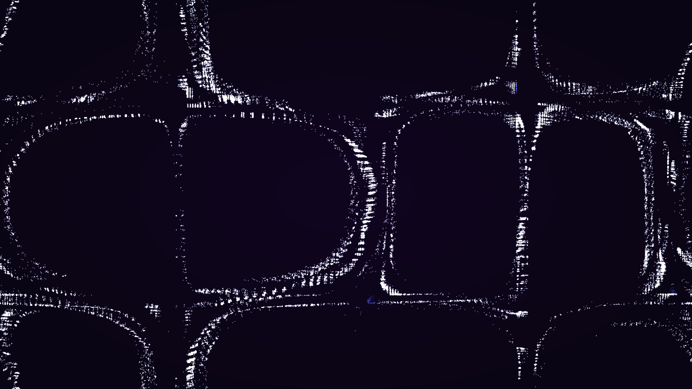

# benard_marangoni_convection

## Metadata
- **Date**: 2026-05-11
- **Theme**: Fluid dynamics, surface tension, Bénard-Marangoni convection, self-organization.
- **Technique**: 2D particle simulation of surface-driven flow. Tracers follow a velocity field derived from surface tension gradients. Features multi-pass additive rendering with a "Deep Violet / Indigo / Silver" palette. 20s 4K/60fps MP4.
- **Logic Lab Reference**: None

## Concept
A shimmering surface organizes into silver-rimmed hexagonal cells, visualizing the spontaneous order of surface-tension driven convection.

## Technical Details
- **Renderer**: P2D
- **Simulation**: particle.
- **Visuals**: additive blending, dark-field contrast.
- **Animation**: 15 seconds at 60fps
