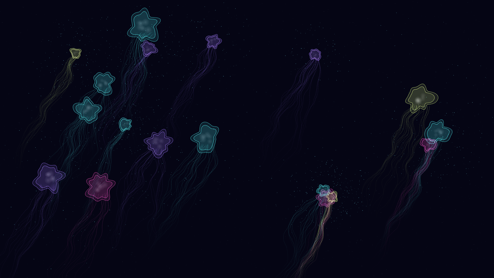

# bioluminescent_deep

## Metadata
- **Date**: 2026-05-02
- **Theme**: marine biology, deep sea, bioluminescence, organic form.
- **Technique**: radial noise shapes, internal glow organs, curling tentacle simulation, organic plankton clustering.
- **Logic Lab Reference**: None

## Concept
A stunning view into the midnight zone of the ocean, featuring glowing jellyfish-like creatures in magenta and cyan surrounded by a dense cloud of bioluminescent plankton and falling marine snow.

## Technical Details
- **Renderer**: P2D
- **Simulation**: radial noise shapes, internal glow organs, curling tentacle simulation, organic plankton clustering.
- **Visuals**: bloom-like highlights, dark-field contrast.
- **Animation**: Animation
