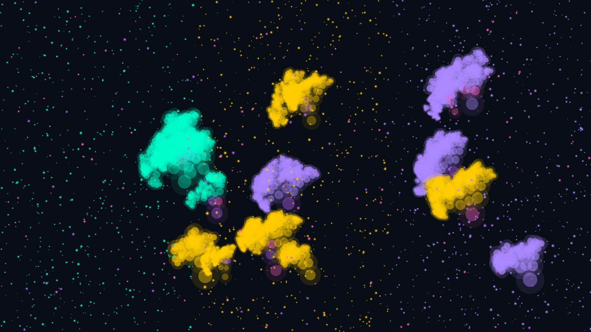

# bioluminescent_forest

## Metadata
- **Date**: 2026-04-28
- **Theme**: nature, bioluminescence, forest, night, organic growth, particle systems.
- **Technique**: recursive tree structures with randomized parameters, particle system with swarm behavior (cohesion, alignment, wandering), depth-based scaling and opacity for 3D spatial relationships, attraction points for organic clustering, varied glow strength based on tree age, ground vegetation with smaller recursive structures, purple/magenta accents in deeper forest areas.
- **Logic Lab Reference**: None

## Concept
A mesmerizing bioluminescent forest where glowing trees and floating fireflies create an enchanting nighttime atmosphere; organic tree structures with randomized parameters, depth-based layering for 3D spatial relationships, and vibrant color transitions from teal to amber to violet with purple and magenta accents in deeper areas.

## Technical Details
- **Renderer**: P2D
- **Simulation**: particle, recursive.
- **Visuals**: bloom-like highlights.
- **Animation**: Still image
