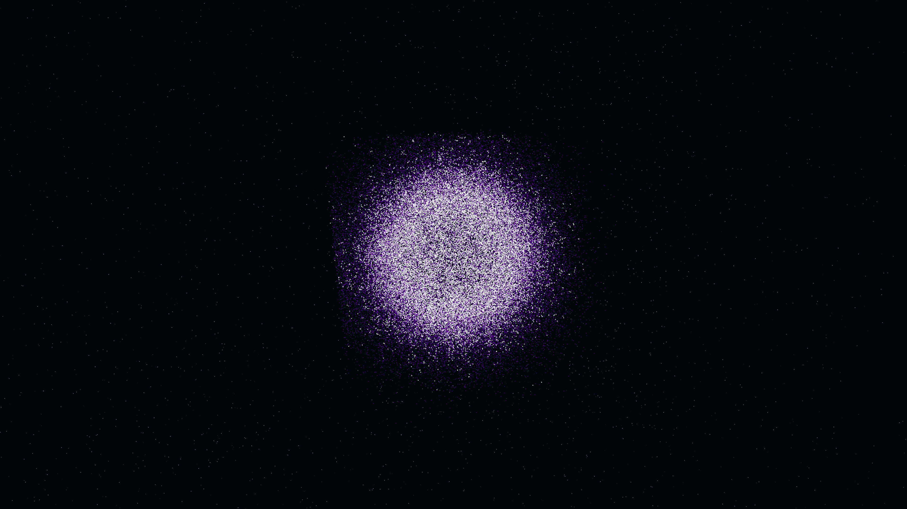

# bioluminescent_mycelial_network

## Metadata
- **Date**: 2026-05-08
- **Theme**: Organic growth, mycelial networks, self-organization, cosmic biological emergence, beautiful night sky.
- **Technique**: 3D agent-based simulation inspired by Physarum polycephalum (slime mold). 200,000 agents navigate a 128x128x128 pheromone density field, depositing trails and steering towards high-concentration gradients. The field is continuously evolved via diffusion (Gaussian blur) and decay using vectorized NumPy and Scipy. Features multi-pass additive point rendering with a "Cyan/Amethyst/White" bioluminescent palette and a high-density background starfield (12,000 stars). 60fps high-bitrate MP4.
- **Logic Lab Reference**: None

## Concept
A majestic vision of cosmic biological emergence; silken threads of electric cyan and royal amethyst light branch and weave through the void, self-organizing into a complex, shimmering mycelial web that pulses with an internal biological rhythm against the star-dusted obsidian night.

## Technical Details
- **Renderer**: P3D
- **Simulation**: Vectorized NumPy, NumPy.
- **Visuals**: additive blending, HSB spectral mapping, persistent trails, bloom-like highlights, prismatic color, dark-field contrast.
- **Animation**: 20 seconds at 60fps
