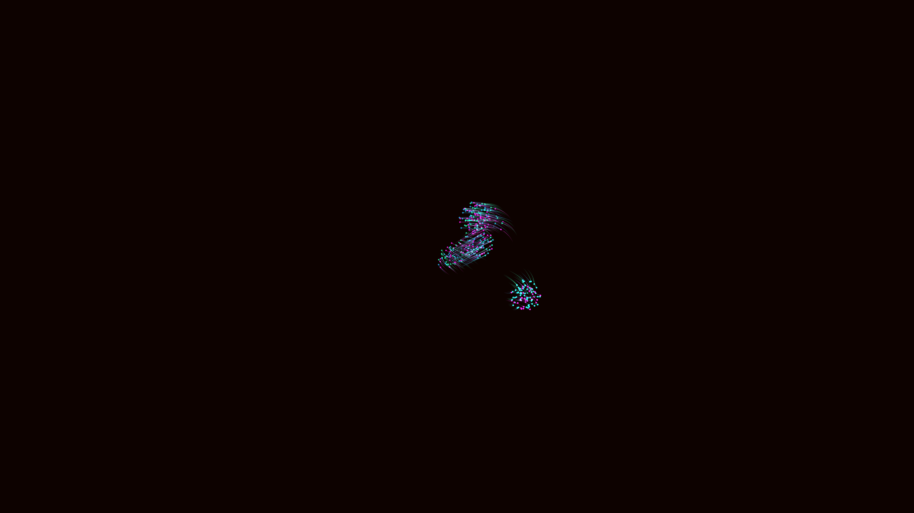

# bioluminescent_neural_swarm_boids_3d

## Details
- **Date**: 2026-06-07
- **Theme**: A microscopic view of abstract, bioluminescent neural organisms multiplying and interacting.
- **Technique**: Boids (flocking) algorithm with glowing trails and additive blending, simulating organic swarming behavior in 3D space.
- **Palette**: Obsidian background, electric blue, bioluminescent green, and neon magenta.

## Media

