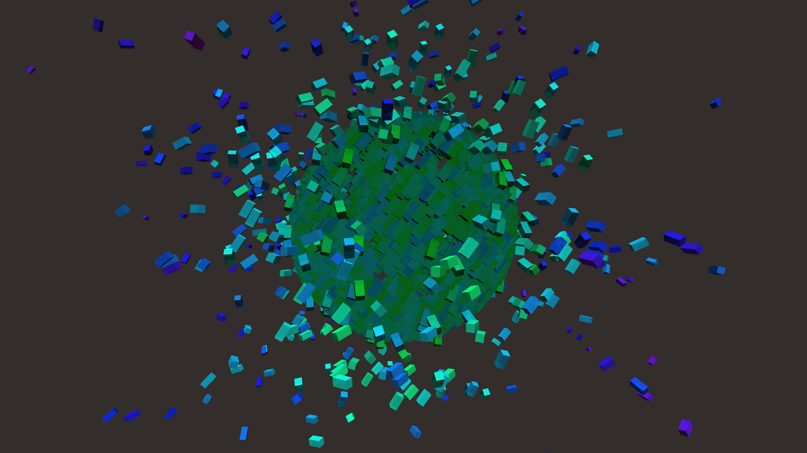

# biomechanical_voronoi_shatter_3d

## Metadata
- **Date**: 2026-06-05
- **Theme**: Generative Art
- **Technique**: A procedurally generated 3D sphere mapped with complex noise to simulate individual shattered pieces drifting outward along their normal vectors.  
- **Logic Lab Reference**: 

## Concept
No concept description provided.

## Technical Details
- **Renderer**: Unknown
- **Simulation**: Unknown
- **Visuals**: Unknown
- **Animation**: Contains animation details
