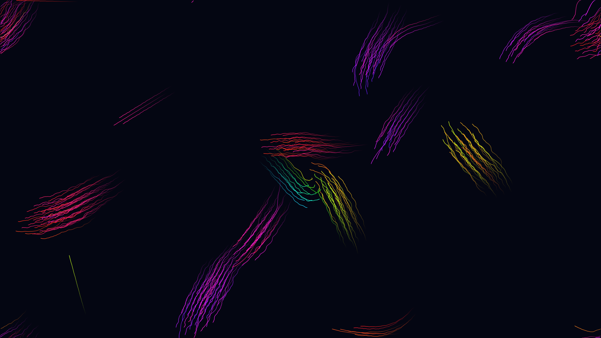

# Boid Flock

300 autonomous agents follow Reynolds' three rules — separation, alignment, cohesion — to form emergent flocks; each agent is colored by its heading angle so flocks glow as coherent ribbons of hue. Fifty-frame trailing arcs trace the swooping collective paths, producing abstract brush-stroke formations that split, merge, and wheel across an 8-second animation.
