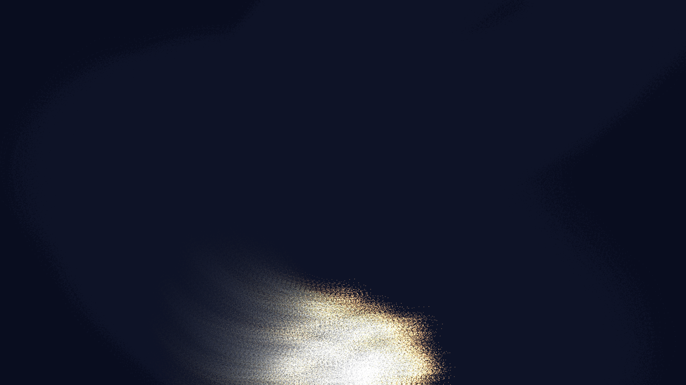

# boid_murmuration_fluid

## Metadata
- **Date**: 2026-05-17
- **Theme**: **Theme**: The breathtaking, emergent intelligence of a massive murmuration flowing and turning like
- **Technique**: Unknown
- **Logic Lab Reference**: 

## Concept
**Theme**: The breathtaking, emergent intelligence of a massive murmuration flowing and turning like liquid through a turbulent wind at dusk.

**Technique**: Vectorized spatial flocking simulation (Boids) for 30,000 agents, coupled with a multi-octave noise wind field. Tracers leave fading silken paths rendered directly into the py5 pixel buffer.

Thousands of tiny sparks sweep across a dark indigo sky, suddenly folding and swooping together into massive, undulating ribbon-like shapes that feel both organic and perfectly synchronized.

## Technical Details
- **Renderer**: Unknown
- **Simulation**: Unknown
- **Visuals**: Unknown
- **Animation**: Unknown
