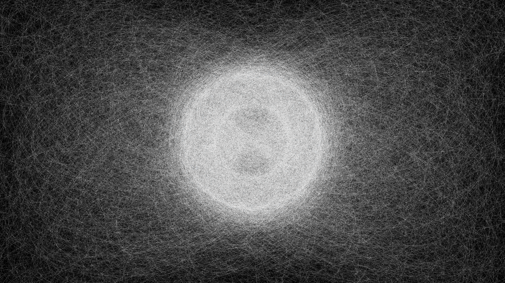

# boids_flocking_swirl

## Metadata
- **Date**: 2026-05-23
- **Theme**: Emergent flocking behavior created by thousands of boids swirling in a chaotic harmony
- **Technique**: Unknown
- **Logic Lab Reference**: 

## Concept
Emergent flocking behavior created by thousands of boids swirling in a chaotic harmony.

- **Date**: 2026-05-23
- **Theme**: Artificial life, emergence, flocking, Craig Reynolds' boids.
- **Technique**: Simulates 10,000 autonomous "boids" using a randomized neighborhood approximation to calculate Separation, Alignment, and Cohesion forces in real time without dropping framerate. The boids are drawn directly to the `py5.np_pixels` buffer, creating smooth additive light trails that slowly fade over time. Colored based on their velocity, transitioning from deep ocean blue to bright bioluminescent cyan as they accelerate. 15s 60fps MP4.
- **Description**: Like a glowing school of deep-sea fish or a swarm of cybernetic fireflies, thousands of bright blue trails swirl around the screen. They continuously split apart, merge, and form massive swirling vortexes, demonstrating how complex, beautiful group dynamics can arise from simple individual rules.

## Technical Details
- **Renderer**: Unknown
- **Simulation**: Unknown
- **Visuals**: Unknown
- **Animation**: Contains animation details
