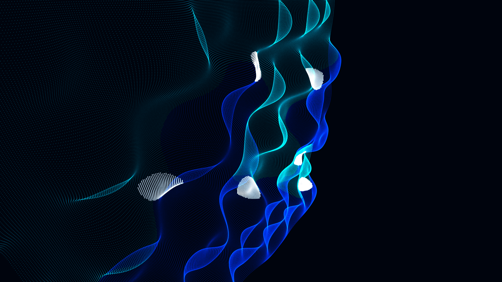

# bose_einstein_condensate_vortices

## Metadata
- **Date**: 2026-05-10
- **Theme**: Quantum fluid mechanics, Bose-Einstein Condensate, quantized vortices, macroscopic quantum phenomena, phase singularities.
- **Technique**: 2D grid mapped to a 3D height map, where the height and color represent the phase and amplitude of a macroscopic quantum wave function. Multiple quantized vortices (points of infinite phase) drift across the grid, creating spiraling interference patterns and ripples. Rendered as a glowing 3D wireframe mesh or dense particle grid with additive blending. Vectorized NumPy operations for the wave function to maintain 60fps.
- **Logic Lab Reference**: None

## Concept
A dense, undulating grid of deep blue and cyan light forms complex, spiraling ripples. Deep, dark singularities drift slowly through the glowing waves, distorting the grid into perfectly quantized spiral arms.

## Technical Details
- **Renderer**: P3D
- **Simulation**: Vectorized NumPy, NumPy, particle.
- **Visuals**: additive blending, HSB spectral mapping, bloom-like highlights, prismatic color, dark-field contrast.
- **Animation**: 15 seconds at 60fps
