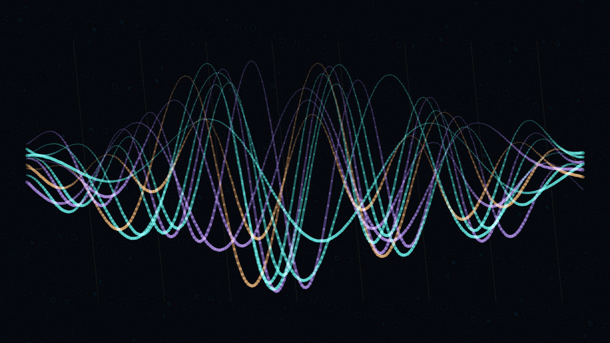

# braid_phase

## Metadata
- **Date**: 2026-05-03
- **Theme**: separate histories, crossing paths, layered memory, mathematical weaving
- **Technique**: Phase-driven strand paths, over-under depth masking, contour-lit strokes, low-contrast phase-field background

## Concept
Teal, violet, and muted-copper strands cross through a dark interference field in layered over-under rhythms; pale edge highlights mark the moments where one history rises above another.

## Technical Details
- **Renderer**: P2D
- **Simulation**: Phase-driven strand paths
- **Visuals**: over-under depth masking, contour-lit strokes, low-contrast phase-field background
