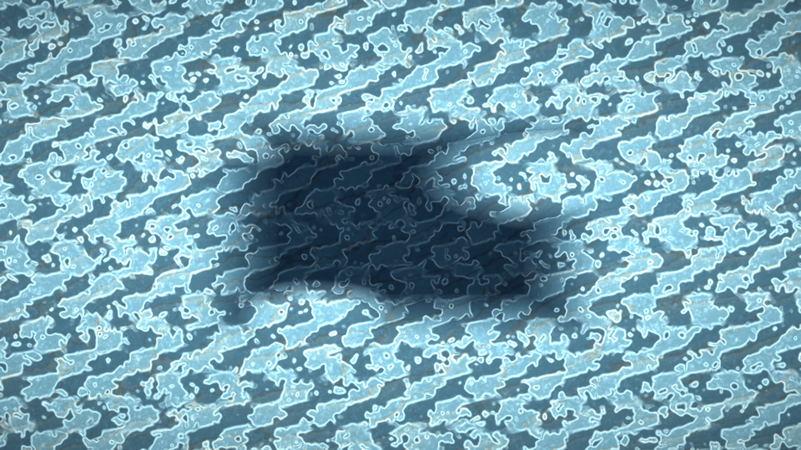

# brine_frost_channel_memory

## Metadata
- **Date**: 2026-05-13
- **Theme**: Sea ice forming under quiet pressure, with trapped brine veins opening and remembering old fracture paths.
- **Technique**: Vectorized 2D phase-field frost growth with animated anisotropic channel fields, edge/freezing nuclei, dendritic crystal texture, brine darkening, and persistent salt-memory highlights rendered directly through the py5 pixel buffer. 10s 4K/60fps MP4.
- **Logic Lab Reference**: None

## Concept
A cold mineral surface freezes inward in porcelain-blue sheets while dark brine veins creep through it; amber salt traces flicker along old cracks, giving the ice a memory of pressure and retreat.

## Technical Details
- **Renderer**: P2D
- **Simulation**: Vectorized 2D phase-field frost growth with animated anisotropic channel fields, edge/freezing nuclei, dendritic crystal texture, brine dark.
- **Visuals**: pixel-buffer rendering, persistent trails, dark-field contrast.
- **Animation**: 10 seconds at 60fps
