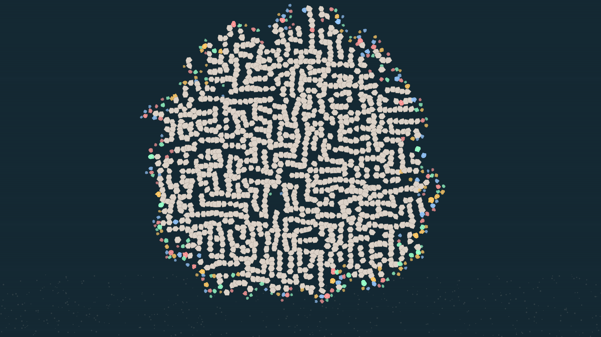

# ca_reef

## Metadata
- **Date**: 2026-05-02
- **Theme**: cellular automata, biology, self-organization, coral.
- **Technique**: multi-state CA, organic polyp rendering, noise-based jitter, atmospheric depth pass.
- **Logic Lab Reference**: None

## Concept
A vibrant, living grid of coral polyps in coral pink and seafoam green, emerging from a calcified rocky base and shimmering underwater atmosphere.

## Technical Details
- **Renderer**: P2D
- **Simulation**: multi-state CA, organic polyp rendering, noise-based jitter, atmospheric depth pass.
- **Visuals**: dark-field contrast.
- **Animation**: Animation
