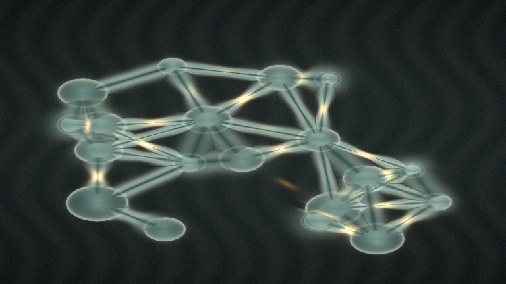

# capillary_bridge_rupture

## Metadata
- **Date**: 2026-05-10
- **Theme**: microscopic droplets forming unstable liquid bridges, stretching under surface tension, and rupturing into faint residue.
- **Technique**: 2D metaball droplet field with animated centers and radii. Near-neighbor segment-distance fields synthesize capillary bridges; a time-varying waist term thins the bridge necks until rupture, accumulating amber residue in a fading buffer. Direct NumPy-to-py5 pixel rendering with FFmpeg output as `output.mp4` and `capillary_bridge_rupture.mp4`. 10s 4K/60fps MP4.
- **Logic Lab Reference**: None

## Concept
Translucent green-blue droplets cling to a dark brushed substrate while thin liquid bridges stretch between them; small amber flashes mark rupture points and leave ghostly residue rings in the fluid network.

## Technical Details
- **Renderer**: P2D
- **Simulation**: NumPy.
- **Visuals**: dark-field contrast.
- **Animation**: 10 seconds at 60fps
