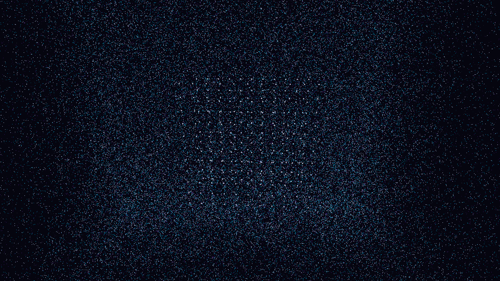

# casimir_vacuum_pressure

## Metadata
- **Date**: 2026-05-09
- **Theme**: Casimir effect, quantum vacuum pressure, beautiful night sky.
- **Technique**: 3D particle physics simulation of 160,000 virtual particles with life-cycle decay and boundary-based suppression. Oscillating parallel plates with glow effects. Multi-pass additive rendering. "Silver / Electric Cyan / Deep Amethyst" palette. 60fps high-fidelity MP4.
- **Logic Lab Reference**: None

## Concept
A serene yet powerful visualization of quantum vacuum pressure; shimmering virtual particles emerge and vanish in a cosmic void, noticeably suppressed in the narrow gap between two silver plates, illustrating the silent force of the void itself.

## Technical Details
- **Renderer**: P3D
- **Simulation**: particle, 3D particle.
- **Visuals**: additive blending, HSB spectral mapping, bloom-like highlights, prismatic color, dark-field contrast.
- **Animation**: 10 seconds at 60fps
