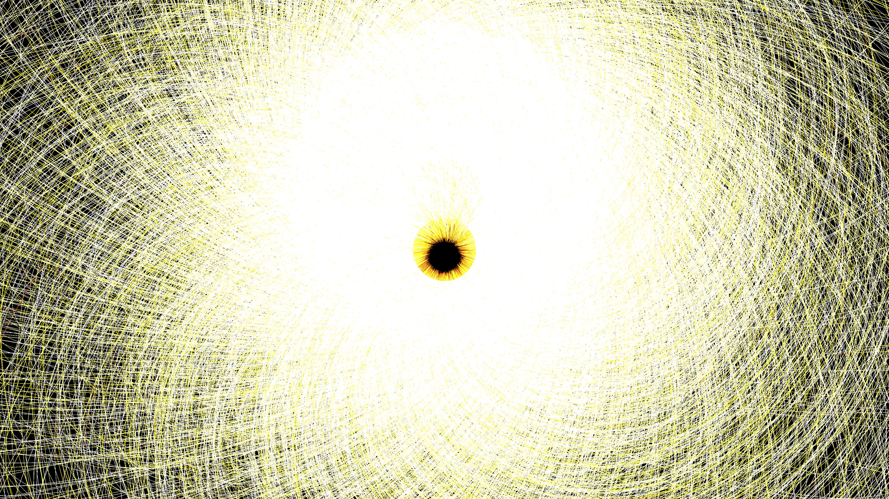

# celestial_black_hole_gravitational_lensing_3d

## Metadata
- **Date**: 2026-06-17
- **Theme**: An animated 3D sequence of a black hole where light rays (particles) bend around an invisible immens
- **Technique**: A 3D particle system simulating photon paths affected by Newtonian gravity. Velocity vectors bend towards the origin inversely proportional to the distance squared, creating lensing. Additive blending with deep oranges and bright whites forms the intense accretion disk.
- **Logic Lab Reference**: 

## Concept
An animated 3D sequence of a black hole where light rays (particles) bend around an invisible immense mass, creating an accretion disk and severe gravitational lensing effects.

## Technical Details
- **Renderer**: Unknown
- **Simulation**: Unknown
- **Visuals**: Unknown
- **Animation**: Unknown
