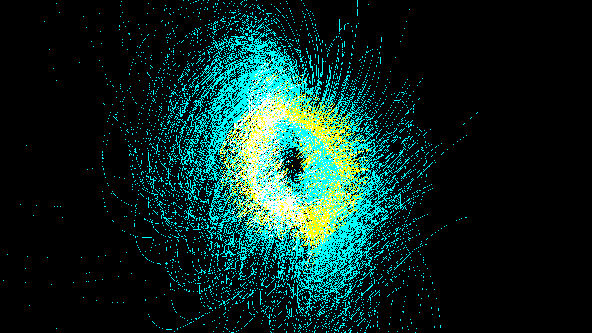

# celestial_n_body_orbital_resonance_3d

## Metadata
- **Date**: 2026-06-14
- **Theme**: An animated 15s sequence showing glowing cyan and amber particle paths looping around three massive 
- **Technique**: 3D multi-body gravitational physics simulation. N-bodies orbit multiple heavy central masses. Their trajectories leave long, fading additive blending trails that weave together into complex orbital resonance patterns (like spirographs but physically simulated).
- **Logic Lab Reference**: 

## Concept
An animated 15s sequence showing glowing cyan and amber particle paths looping around three massive attractors, creating an intense, structured celestial structure in a dark void.

## Technical Details
- **Renderer**: Unknown
- **Simulation**: Unknown
- **Visuals**: Unknown
- **Animation**: Unknown
